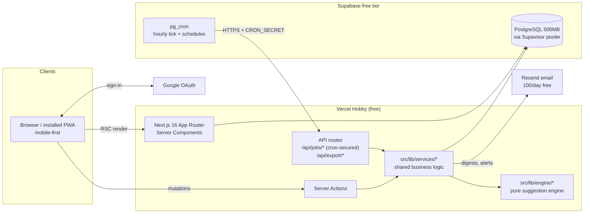
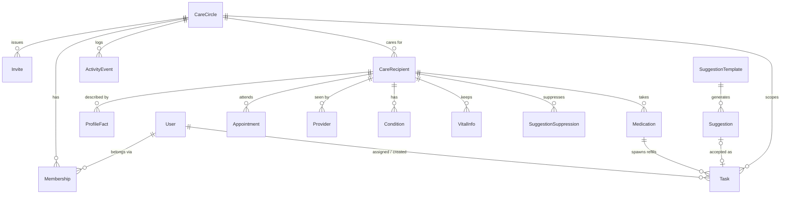

# Keeper v2 — Product & Implementation Spec

**Parental care tracking with predictive seasonal suggestions**

| | |
|---|---|
| Status | Draft for review |
| Author | Claude (for Pranava) |
| Date | 2026-07-14 |
| Scope | Web app v2 (transforms the current deployed v1); iOS path defined but not built |
| Companion docs | `CLAUDE.md` (project rules), `backlog.md` (reconciled in §17), `~/Projects/coding-best-practices/` (base engineering/design canon — see §19) |

---

## Table of contents

1. [Where we are today (current-state audit)](#1-where-we-are-today)
2. [Problem statement, goals, non-goals](#2-problem-statement-goals-non-goals)
3. [Market scan: what's out there](#3-market-scan)
4. [Users, jobs-to-be-done, capabilities, scenarios](#4-users-jobs-capabilities-scenarios)
5. [Product principles](#5-product-principles)
6. [Feature specification (P0/P1/P2 + acceptance criteria)](#6-feature-specification)
7. [UX: information architecture, flows, click budgets](#7-ux-information-architecture-and-flows)
8. [Design language](#8-design-language)
9. [Architecture & hosting decision](#9-architecture)
10. [Data model](#10-data-model)
11. [The suggestion engine](#11-the-suggestion-engine)
12. [Testing infrastructure & apparatus](#12-testing-infrastructure)
13. [Notifications & scheduled jobs](#13-notifications-and-scheduled-jobs)
14. [Success metrics](#14-success-metrics)
15. [Rollout plan (milestones M0–M4)](#15-rollout-plan)
16. [Risks & mitigations](#16-risks-and-mitigations)
17. [Backlog reconciliation](#17-backlog-reconciliation)
18. [Open questions for Pranava](#18-open-questions)
19. [Engineering & design canon](#19-engineering-and-design-canon)
20. [Appendix A: suggestion template catalog](#appendix-a-suggestion-template-catalog)

---

## 1. Where we are today

Keeper v1 is live at `keeper-production-a8ea.up.railway.app` (Railway, PostgreSQL). It is a working sibling task board with a health-info page — a good skeleton, but it does not yet do the three things this spec exists for: **model the parents**, **track medical structures** (appointments, prescriptions), or **predict tasks you didn't think of**.

### What exists and works

| Area | State | Files |
|---|---|---|
| Task board | Tasks with type (Medical/Household/Errand/Note), status, due date, assignee; tabs for Unassigned/Mine/History; swipe to assign/resolve; quick-add FAB; edit dialog | `src/app/(app)/dashboard/`, `src/components/task-card.tsx` |
| Vital info | Freeform category → text blocks (Medications, Allergies, Doctors, Insurance, Emergency Contacts) | `src/app/(app)/vital-info/` |
| Doctor's brief | CSV export of Medical tasks | `src/app/api/export/medical-csv/` |
| Server Actions | CRUD with zod validation (added after UAT 2026-03-18) | `src/lib/actions/*.ts` |
| UI kit | Radix primitives, Tailwind v4 oklch tokens (warm off-white + soft teal), Sonner toasts, bottom nav, member color avatars, empty states, loading skeletons | `src/components/`, `src/app/globals.css` |
| Auth plumbing | NextAuth v5 configured with Google provider + phone-OTP credentials provider — **but bypassed**: every action resolves `getDevUserId()` (hardcoded `pranava@family.dev`) | `src/lib/auth.ts`, `src/lib/dev-user.ts` |
| Notifications | Console-log stub only | `src/lib/notifications.ts` |
| Deploy | Railway auto-deploy from `main`; build runs `prisma db push` + idempotent seed | `package.json`, `CLAUDE.md` |

### Structural gaps this spec closes

1. **No care-recipient entity.** "Mom" and "Dad" don't exist in the data model. VitalInfo is implicitly about one unnamed person; tasks can't say *who* they're for. Everything predictive depends on fixing this.
2. **No tenancy.** Every query is global (open issue UAT-001). Sharing with your brother is currently "everyone sees one global pile." A `CareCircle` boundary is a precondition for real auth.
3. **No medical structures.** Medications, appointments, providers, and conditions are lines inside a text blob — nothing can remind you a refill is due or that a follow-up was never booked.
4. **Nothing recurs, nothing predicts.** Every task is manually created once. The core ask — "surface the lawn mowing / driveway shoveling / Medicare-window stuff I didn't schedule" — needs a template catalog, a profile of each parent's life, and an engine that joins them against the calendar.
5. **Auth is bypassed and notifications are fake.** Both are prerequisites for the app being usable by two people in the real world.

---

## 2. Problem statement, goals, non-goals

### Problem statement

Two brothers coordinate the care of their aging parents across medical logistics (appointments, prescriptions, doctors), household upkeep (chores, repairs, seasonal work), and everything in between. Today that coordination lives in memory, texts, and ad-hoc lists — so recurring needs get noticed late (the prescription that ran out, the lawn that's a month overgrown, the Medicare window that closes in a week), and neither brother has a reliable picture of what the other has handled. The cost of a miss ranges from a weekend scramble to a genuine health risk.

The deeper problem is that **the hardest tasks to track are the ones nobody wrote down**. A shared to-do list only helps with known work. Elders' lives generate *predictable but unscheduled* work — seasonal, medical-administrative, and equipment-driven — that adult children discover reactively.

### Goals (measurable outcomes, not features)

| # | Goal | Measured by |
|---|---|---|
| G1 | **Nothing important slips.** Medical tasks and appointments never sit overdue unnoticed. | Zero medical tasks overdue >48h without a notification landing; appointment no-shows = 0 |
| G2 | **The app knows things the brothers didn't schedule.** Predictive suggestions are useful, not noise. | ≥40% of surfaced suggestions accepted or adjusted (not dismissed) in first season; ≥60% by second season after feedback tuning |
| G3 | **Both brothers actually use it.** | Both members active (viewed or acted) in ≥3 of any 4 consecutive weeks |
| G4 | **Capture is near-frictionless.** | Adding a task ≤15 seconds / ≤6 taps; completing = 1 gesture; accepting a suggestion = 2 taps |
| G5 | **Free to run.** | $0/month infrastructure at current scale (excl. optional Apple Developer fee later) |

### Non-goals (v2)

- **No clinical/EHR integration or HIPAA posture.** This is a family notebook, not a medical record system. (Backlog already marks this a deliberate non-goal; it creates enterprise-grade compliance surface for zero family value.)
- **No caregiver marketplace, volunteer boards, fundraising, or social feeds.** Validated as complexity-without-value in the v1 competitive research.
- **No native iOS build yet.** The path is specified (§9.6) and architectural choices protect it, but v2 ships as a mobile-first web app / PWA.
- **No SMS in v2.** Email + (later) web push. SMS costs money, requires A2P 10DLC registration hassle, and the two users both have email on their phones. Revisit only if reminders demonstrably get missed (§13).
- **No automatic weather-API-driven triggers in v2.** Seasonal windows are date-based per climate region; live weather ("snow forecast tonight → shovel tomorrow") is a P2 enhancement (§11.6).
- **No ML.** "Predictive" here means a curated rule catalog evaluated against profile facts and the calendar — deterministic, testable, explainable. An LLM personalization layer is P2 and additive.

---

## 3. Market scan

Live research, July 2026. Full sourcing inline; App Store figures pulled from listing pages during research.

### 3.1 The category today

| App | State (2026) | What it is | Free tier | Signal for Keeper |
|---|---|---|---|---|
| [Caring Village](https://caringvillage.com/pricing/) | Alive; category leader by marketing | Calendar, tasks, meds, doc vault, AI chat "Julia" | **2 members only**; paid $14.99–24.99/mo | Closest analog; reviews cite bugs (calendar off-by-one), rigid templates, tiny real install base (35 iOS ratings) |
| [CircleCare](https://circlecare.app/) | New, launched Jan 2026 | Sibling-focused circles, task claiming, contribution visibility | 2 caregivers; $6.99/mo premium | Validates the sibling-equity angle; negligible traction so far (3 ratings) — the window is open |
| [TendTo](https://tendto.ai/) | New ~2025–26, PWA | "AI caregiver command center": meds w/ label scan, bills, doc vault, AI assistant "Tali" | 1 circle, capped; $11.99–19.99/mo | Built to harvest CareZone refugees; **explicitly no home-maintenance/seasonal scope** (verified on site) |
| [Lotsa Helping Hands](https://apps.apple.com/us/app/lotsa-helping-hands/id606923858) | Alive but degraded (iOS 2.7★) | Volunteer community coordination (meals, rides) | Free | Reliability, not features, is where the category fails: login crashes, no mobile calendar |
| [CaringBridge](https://www.caringbridge.org/) | Alive, healthy nonprofit (4.9★) | Health-update journaling/broadcast | Free | Not a task engine; different job |
| [ianacare](https://ianacare.com/) | Alive, pivoted B2B (employers/Medicare) | Support mobilization + human navigators | Free consumer | Weak on recurring chores/med logistics |
| [Jointly](https://jointlyapp.com/) (Carers UK) | Alive | Tasks, meds, health log | £2.99 one-off per circle | UK-centric, dated UX |
| [Cozi](https://www.cozi.com/) | Alive, reputation damaged | General family calendar | 2024 paywall backlash (~2.1★ Trustpilot) | Cautionary tale: punitive free tiers burn trust |
| CareZone | **Dead** (Walmart retired it 2023; user data deleted) | Was the meds+family standard | — | Orphaned cohort still cited by every new entrant; data portability is a trust feature |
| [Medisafe](https://apps.apple.com/us/app/medisafe-medication-management/id573916946) / [MyTherapy](https://www.mytherapyapp.com/) | Alive (4.7★ / 10M+ users) | Med adherence for the patient | Medisafe free now ~2 meds; MyTherapy free w/ ads | The one proven pattern to borrow: **Medfriend** — a caregiver is notified on missed dose (71% adherence improvement claimed) |
| [HomeZada](https://www.homezada.com/homeowners/home-maintenance) / [Thumbtack Home Care Plan](https://help.thumbtack.com/article/manage-home-care-plan) / [Dwellin](https://dwellin.com/) / [TidyBoss](https://mytidyboss.com/) | Alive (Centriq died Jan 2025, data deleted) | Home-maintenance schedule generators | Thumbtack free (lead-gen); HomeZada $99/yr premium | **The prediction mechanism exists and is validated** — location/climate + home systems → seasonal schedule. But all assume the owner maintains their own home; none has a care circle, meds, or multi-person assignment |

B2B tier (Homethrive, Carallel, Trualta, Sensi.ai) validates that employers and Medicare plans pay for caregiving support, but none of it is a consumer sibling tool. Grayce exited to Cariloop in 2025.

### 3.2 What this means for Keeper

1. **The core combination is unoccupied (verified).** No app joins care coordination with predictive seasonal/home tasks. ElderNest (Jan 2025) lists home-maintenance tasks but manual-only; TendTo explicitly scopes it out; HomeZada/Thumbtack have the engine but no family layer. Keeper's "parent's-house seasonal autopilot with sibling assignment" has no direct competitor.
2. **AI in this category answers questions; it doesn't plan.** Julia and Tali are reactive chatbots. A deterministic rules catalog that *proactively generates* dated, explained, assignable tasks would be the first planner in the category — and it's cheaper and more trustworthy than an LLM guessing.
3. **Reliability is the moat nobody built.** Category leader sits at 2.7★ on crashes and sync bugs. A small, boring, fast app that never loses data beats a feature matrix. (This is also why the testing section of this spec is long.)
4. **Free tiers in this category are punitive** (2 members, 2 meds, 30-day calendars). Keeper is personal software — its "free tier" is the whole product, which the $0 stack (§9) makes sustainable.
5. **Data portability is a trust feature with real history** — CareZone and Centriq both deleted user data at shutdown. Keeper keeps CSV export, adds a printable ER brief, and owns its Postgres data with no proprietary SDK coupling.
6. **The Medfriend pattern** (notify the *caregiver*, not just the patient) maps directly onto refill tracking and threshold alerts later.

---

## 4. Users, jobs, capabilities, scenarios

### 4.1 Personas

| Persona | Description | Access |
|---|---|---|
| **The coordinator (Pranava)** | Adult son; initiates the system, holds the fullest picture of parents' medical and household reality; sets up profiles, reviews suggestions, invites family | Owner |
| **The sibling (brother)** | Co-caregiver; needs zero-setup entry, a clear "what needs doing / what's mine" view, and confidence he isn't duplicating or missing work | Member |
| **Extended family (later)** | Aunt, cousin, or the parents themselves; may need read-only visibility without the obligation to participate | Viewer (P1) |

Both active personas are busy professionals on phones. Design target is the coordinator's Saturday-morning triage and the sibling's 30-second glance, both one-handed on a phone.

### 4.2 Jobs-to-be-done

| # | When… (situation) | I want to… (motivation) | So I can… (outcome) |
|---|---|---|---|
| J1 | I notice something at my parents' house or on a call | capture it in seconds, from my phone, mid-conversation | trust the system instead of my memory |
| J2 | It's the weekend and I have a few free hours | see what's due, overdue, and coming for each parent in one glance | spend the hours doing, not reconstructing |
| J3 | A season is turning (first frost, spring growth, summer heat) | be told what their house and life will need *before* it's urgent | handle lawn/gutters/furnace/AC on my schedule, not the emergency's |
| J4 | A prescription is running low | be reminded ahead of the runout with pharmacy details at hand | never let them hit a zero-pill day |
| J5 | An appointment happened or is coming | know who's taking them, what came out of it, and what follow-up it spawned | keep continuity of care across two brothers |
| J6 | My brother asks "what needs doing?" or "did anyone handle X?" | point at one shared, current picture | coordinate without narrating status over text |
| J7 | An annual administrative window opens (Medicare enrollment, taxes, RMDs, registrations) | get the date-bound stuff surfaced with its real deadline | never discover a closed window after the fact |
| J8 | I'm at a doctor/pharmacy/ER with a parent | pull up meds, allergies, doctors, insurance instantly | answer intake questions accurately under stress |
| J9 | A suggestion doesn't fit our reality (no lawn; dad still mows himself) | correct the system once | make future predictions smarter, not repetitive noise |
| J10 | Weeks pass | notice the imbalance if one of us is carrying most of the load | rebalance before resentment builds |

### 4.3 Capability inventory ("the user can…")

**Account & family** — sign in with Google in one tap (browser or phone) · create a family circle · invite a sibling by share-link · join a circle from an invite link with Google sign-in · see who's in the circle · leave/remove members (owner).

**Parents (care recipients)** — add each parent with name, birth year, and where/how they live · answer a short home-facts interview (lawn? driveway? gutters? fireplace? car? stairs? lives alone?) · edit any fact later on a "What Keeper knows" screen · see everything for one parent in one place.

**Tasks** — add a task in ≤6 taps (title, parent, type, due, assignee — only title required) · assign to self or sibling · complete with one swipe · make any task recurring (interval or seasonal) · see Today / This week / Overdue · filter by parent, type, assignee · see history.

**Medical** — keep a structured medication list per parent (drug, dose, schedule, prescriber, pharmacy, refill interval) · get refill-due tasks generated automatically · mark "picked up" to reset the clock · log appointments with provider, date/time, and who's going · get prompted afterward for outcome + follow-up · keep a provider directory · keep conditions and vital info per parent · export/show an ER-ready brief.

**Suggestions** — see a small stack of suggested tasks, each with a plain-language reason and a due window · accept (→ real task, optionally recurring) · adjust (change date/assignee/cadence, then accept) · snooze · dismiss with a why ("not applicable" teaches the profile) · preview upcoming season's suggestions.

**Awareness** — receive a morning email digest (due today, appointments, new suggestions) · receive immediate email when assigned something urgent · see an activity feed of who did what · see a 7/30-day workload summary per member.

### 4.4 Scenarios

**S1 — Saturday triage.** Pranava opens Keeper with coffee. Today shows: two overdue (Dad's furnace filter, Mom's blood-pressure recheck booking), one appointment Tuesday (cardiologist — brother marked himself as taking her), and three suggestions for late October: *gutter cleaning after leaf drop*, *set clocks / check smoke detector batteries (DST ends Nov 1)*, *Medicare Open Enrollment opened Oct 15 — review Mom's Part D*. He accepts all three, assigns gutters to himself for next Saturday, snoozes the Medicare one a week. Four minutes, done.

**S2 — The refill save.** Metformin was last filled 82 days ago on a 90-day fill. Keeper creates "Refill Metformin — CVS Main St" due in 5 days and it rides the morning digest. Brother grabs it on his commute, swipes complete; Keeper resets the cycle and logs it to the feed. Mom never knows it was ever close.

**S3 — First snow.** It's Dec 3 in a snow-region zip. The seasonal window for *arrange snow removal / check ice melt stock* fired back on Nov 10 as a suggestion; Pranava accepted it then and hired the neighbor's kid. Tonight's forecast is irrelevant — the driveway was already handled the calm way, weeks before the scramble.

**S4 — The ER pocket card.** Dad has a fall; brother rides along. At intake, on his phone: Dad's page → meds with doses, allergy (penicillin — rash), cardiologist's name and number, Medicare + supplement IDs. Reads it straight to the nurse. No calls to Pranava, no guessing.

**S5 — The correction.** Keeper suggests "schedule lawn mowing" in April. Dad still mows his own lawn and is proud of it. Pranava dismisses with "they handle this themselves." Keeper records the fact against Dad's profile and never suggests mowing again — but keeps suggesting *mower blade sharpening + tune-up* each spring, which is exactly the kind of adjacent task nobody remembers. (Facts are editable if Dad's situation changes.)

**S6 — The quiet ledger.** Their cousin visits monthly and wants to help but hates apps. Brother sends the invite link with viewer access; cousin can see the week's needs without creating noise. Meanwhile the workload view shows brother at 70% of completions this month — Pranava takes the next three suggestions himself. Nobody had to have a conversation about fairness; the data ambient-nudged it.

---

## 5. Product principles

1. **The calendar is the product.** Keeper's differentiation is *when-awareness*: seasonal windows, refill cycles, enrollment deadlines, follow-up cadences. Every feature should make "what does this week require?" more answerable.
2. **Suggest, never nag; explain, never spam.** Every prediction carries its reason in plain language. Max 5 pending suggestions surfaced at a time. Dismissals teach the system. A wrong suggestion repeated is a bug.
3. **Capture beats structure.** A one-line task typed in 10 seconds beats a perfectly categorized one that never got entered. Structure (parent, type, due) is always optional at capture time and cheap to add later.
4. **Two-person honesty.** This is a tool for a pair of brothers, not a team of forty. No gamification, no streaks, no leaderboards — just visibility (feed, workload) that keeps two adults honest and informed.
5. **Own the data, keep it portable.** Plain Postgres via Prisma, no proprietary SDK coupling, export always available. The stack must survive a hosting migration in an afternoon (it will get one in M0).
6. **Free tier is a design constraint** (per `CLAUDE.md`): $0/month target shapes hosting, email volume (digest > per-event), and the no-SMS call.
7. **Boring, testable intelligence.** The engine is rules + facts + dates — deterministic and unit-testable to the day. Cleverness lives in the catalog's quality, not the algorithm's opacity.

---

## 6. Feature specification

Priorities follow MoSCoW discipline: **P0** = v2 cannot ship without it; **P1** = fast-follow, designed-for now; **P2** = future, architecture must not preclude it. Acceptance criteria are checklists; every P0 criterion becomes a test.

### 6.1 Authentication & family circle — P0

Real Google sign-in replaces the dev bypass; a `CareCircle` becomes the tenancy boundary (fixes UAT-001's global queries).

- [ ] "Continue with Google" is the only visible sign-in path; completes in ≤2 taps on phone and desktop browser. One Tap prompt on return visits where supported (§9.3).
- [ ] First sign-in with no circle → onboarding (§7.3). First sign-in via invite link → lands inside the inviter's circle.
- [ ] Every Server Action and page resolves the acting user from the session — never from client input; every query is scoped by the member's circle. `src/lib/dev-user.ts` is deleted; grep for `getDevUserId|DEV_USER|TODO` returns zero hits.
- [ ] Unauthenticated access to any `(app)` route redirects to `/login`; unauthenticated Server Action invocation returns an auth error (tested).
- [ ] Phone-OTP mock login is removed entirely (no SMS in v2, §2 non-goals).
- [ ] Sign-out works; sessions survive browser restarts (30-day session).

### 6.2 Care recipients & profile facts — P0

Parents become first-class. Each `CareRecipient` carries identity plus the **profile facts** that drive predictions.

- [ ] Circle supports 1–4 recipients (Mom, Dad; extensible to in-laws). Create with name + relationship; birth year, ZIP, residence type optional but prompted.
- [ ] Home-facts interview: ~10 tappable yes/no/unknown chips (lawn, driveway, gutters, fireplace/chimney, car, stairs, lives alone, basement, window AC units, pets). Skippable; every skip = "unknown," which suppresses dependent suggestions rather than guessing.
- [ ] Health flags relevant to cadence rules (diabetes, heart condition, enrolled in Medicare Advantage, owns IRA/401k — see §11.3) settable at onboarding or later.
- [ ] A **"What Keeper knows"** screen per parent lists every fact with its provenance (you said / inferred from a dismissal / default) and lets any member correct it in one tap. Facts changed here immediately affect the next engine run.
- [ ] Existing `VitalInfo` rows migrate to recipient-scoped records (migration: attach all current data to the first recipient created, since v1 tracked one implicit person).
- [ ] Tasks, meds, appointments, providers, conditions, and vital info all reference a recipient; recipient delete requires typed confirmation and cascades (with a pre-delete export offer).

### 6.3 Tasks & recurrence — P0

The existing task board stays the spine; it gains scoping, recipients, and recurrence.

- [ ] Task gains: `circleId` (required), `recipientId` (optional — some tasks are general), `priority` (normal/urgent), recurrence fields (§10), and provenance (`suggestionId` when accepted from the engine, `medicationId` when generated by the refill loop).
- [ ] Existing enum types (Medical/Household/Errand/Note) and statuses (Open/InProgress/Resolved) are unchanged — v1 muscle memory survives.
- [ ] Recurrence: none / every N days / weekly / monthly / yearly / seasonal-window. Completing a recurring task immediately materializes the next instance with the next due date (materialized-next-instance model — no virtual occurrences; simple to query and test).
- [ ] Recurring tasks display their cadence and can be ended ("stop repeating") from the edit sheet.
- [ ] Swipe-complete, swipe-assign, quick-add FAB, and edit dialog all preserved; quick-add gains a parent chip and priority toggle without increasing required taps (title remains the only required field).
- [ ] Overdue is a first-class state in queries and UI (due date < today && not Resolved), not a client-side afterthought.

### 6.4 Medical module — P0 (meds, appointments, providers), P1 (conditions detail)

**Medications & refill loop (P0)** — the highest-stakes recurring object in the system.

- [ ] Med list per parent: name, dose, schedule text, prescriber (link to provider), pharmacy, refill interval (days), last-filled date, active flag, notes. Entry ≤60s per med; no dose-time-level tracking (that's the patient-adherence job — Medisafe's; ours is the *logistics* job).
- [ ] When `lastFilledAt + refillIntervalDays − leadDays` arrives (default lead 7 days), the engine generates a "Refill [med] — [pharmacy]" task, assigned per the med's default or unassigned. One task per cycle, deduped.
- [ ] "Mark filled" on the task (or the med) resets the cycle and logs to the activity feed.
- [ ] Deactivating a med stops future refill tasks and hides it from the ER brief's active list (kept in history).
- [ ] Med list renders in the ER brief (§6.9) exactly as a nurse needs it: name — dose — schedule.

**Appointments & providers (P0)**

- [ ] Provider directory per parent: name, specialty, phone, address, notes. Creatable inline from the appointment form (typeahead over existing).
- [ ] Appointment: parent, provider (optional), title, date/time, location, who's-taking-them (member), notes. Lives in its own table; Today/Calendar views union appointments with tasks into one timeline (§10 — no dual-write of a shadow task).
- [ ] Appointments emit reminders on the digest (day before + day of).
- [ ] After the appointment time passes, its card flips to an outcome prompt: "How did it go?" → outcome note + one-tap "add follow-up task" (pre-filled: parent, Medical type) and/or "book next appointment."
- [ ] Cancelling/rescheduling keeps history (status: scheduled/done/cancelled).

**Conditions (P1)** — named ongoing issues (e.g., "Type 2 diabetes," "AFib") with notes and linked providers; the P0 subset is a simple list because condition *flags* feed the engine (§11.3) from day one.

### 6.5 Predictive suggestions — P0 (the reason v2 exists)

Deterministic engine (rules × facts × calendar), full algorithm in §11; catalog in Appendix A.

- [ ] Engine runs nightly (cron, §13) and on profile-fact changes; produces `Suggestion` rows per circle from the template catalog, deduped per cycle (a template fires once per its window/interval, not daily).
- [ ] Every suggestion carries: title, parent (when recipient-specific), a due window, and a **plain-language reason** ("Dad's furnace is due for its annual service before heating season — Sep–Oct is the window").
- [ ] Surfacing budget: max 5 pending suggestions visible on Today; the rest wait in the suggestion inbox. New-suggestion count rides the morning digest.
- [ ] Actions: **Accept** (→ task, with sensible default due date + optional recurrence pre-set from the template) · **Adjust** (edit date/assignee/cadence in the same sheet, then accept) · **Snooze** (this cycle) · **Dismiss with reason**: "not applicable" (→ records/updates the underlying profile fact and suppresses the template), "they handle it themselves" (→ suppresses but keeps adjacent templates, per §4.4 S5), "just not now" (→ expires this cycle only).
- [ ] A dismissed-for-fact template never fires again unless the fact is edited on "What Keeper knows" (tested).
- [ ] Season preview: a screen listing what the engine will suggest over the next 90 days, so the brothers can plan ahead of the notifications.
- [ ] Onboarding ends with a preview of the first ~5 suggestions generated from the just-entered facts (§7.3) — the aha moment.
- [ ] v1 catalog ships with ≥50 active templates spanning home/seasonal, elder safety, medical-admin, vehicle, and financial-admin categories (Appendix A), each with a source URL stored on the template.

### 6.6 Notifications — P0 (email), P1 (web push)

Full pipeline in §13.

- [ ] Morning digest email (~8:00 local, per-user timezone): overdue, due today, today's/tomorrow's appointments, new suggestions count. Sent only when non-empty. One email, both brothers, individually addressed.
- [ ] Immediate email on: task assigned to you by someone else, urgent-priority task created, invite received.
- [ ] Weekly lookahead email (Sunday evening): the week's tasks + appointments + suggestion preview.
- [ ] Per-user toggles (digest / immediate / weekly) in settings; unsubscribe link in every mail footer that deep-links to settings.
- [ ] All sends logged (`NotificationLog`) with skip reasons — silent failure is a bug (per `CLAUDE.md` fail-loud rule).
- [ ] P1: web-push for installed PWA (iOS 16.4+ home-screen; declarative push where available) carrying the same events as immediate email.

### 6.7 Sharing & invites — P0

- [ ] Owner/member can generate an invite link (7-day expiry, revocable); share via the native share sheet (iMessage/WhatsApp/email — no in-app SMS sending).
- [ ] Opening the link → Google sign-in → lands in the circle with member role. Total taps for the brother: open link, tap Google, done.
- [ ] Roles: **owner** (manage members/recipients/delete circle), **member** (full read-write), **viewer** (P1 — read-only; for extended family per S6).
- [ ] Members screen shows who's in, their color, last-active; owner can revoke membership.

### 6.8 Activity feed & workload visibility — P1 (backlog High, promoted into M3)

- [ ] Every mutating action writes an `ActivityEvent` (actor, verb, target, meta) — this table also powers metrics (§14).
- [ ] Feed: reverse-chron cards (avatar + sentence + timestamp), filterable by parent. No reactions, no comments.
- [ ] Workload: per-member counts over 7/30 days (completed tasks, meds handled, appointments attended, check-ins). Quiet presentation — numbers, not charts with winners.

### 6.9 Trust & export — P1

- [ ] **ER brief**: a single printable/PDF-able screen per parent — active meds w/ doses, allergies, conditions, providers w/ phones, insurance IDs, emergency contacts. Reachable in ≤2 taps from the parent hub (S4). Extends the existing CSV export route pattern.
- [ ] Full-circle data export (JSON + CSVs) from settings — the anti-CareZone promise.

### 6.10 Explicitly P2 (designed-for, not built)

Weather-event triggers (snow forecast → shovel task; heat advisory → check-in) · LLM personalization layer (freeform "about Dad" notes → proposed custom templates; weekly natural-language summary email — Haiku-class model, cheap) · structured vitals + threshold alerts (backlog items, kept) · Medfriend-style missed-dose alerts (needs dose-level tracking — deliberate v2 non-goal) · multi-circle support (schema allows; UI assumes one) · voice capture · calendar (ICS) feed export.

---

## 7. UX: information architecture and flows

### 7.1 IA — four tabs + FAB

Bottom nav (`bottom-nav.tsx`) goes from 3 to 4 destinations:

| Tab | Contents | Replaces |
|---|---|---|
| **Today** | Overdue → due today → appointments → suggested (≤5) → recently done. The answer to "what needs attention?" | Dashboard |
| **Calendar** | Week strip (7 dots/day, per-member colors) + day list; month toggle. Unions tasks + appointments. | — (backlog "Week Calendar View") |
| **Parents** | Recipient switcher chips → per-parent hub: Meds · Appointments · Providers · Conditions · Vital info · ER brief · "What Keeper knows" | Health/vital-info |
| **Family** | Activity feed · workload · members + invite · settings entry | Settings (settings nests here) |

Quick-add FAB persists on Today/Calendar/Parents. Suggestion inbox lives at the top of Today with a count pill; season preview linked from there.

### 7.2 Click budgets (tested in E2E, §12.4)

| Job | Budget | Path |
|---|---|---|
| Complete a task | 1 gesture | swipe right on card |
| Accept a suggestion | 2 taps | card → Accept |
| Accept with changes | ≤5 taps | card → Adjust → tweak → Save |
| Add a task (title only) | 3 taps + typing | FAB → type → Save |
| Add fully-specified task | ≤6 taps + typing | FAB → type → parent chip → type chip → due → assignee → Save |
| Log a refill pickup | 2 taps | task swipe *or* med row → "Mark filled" |
| Reach ER brief | 2 taps | Parents → ER brief (also linked from parent hub header) |
| Invite brother | 3 taps | Family → Invite → share sheet |
| Correct a wrong fact | 3 taps | Parents → What Keeper knows → toggle |

### 7.3 Onboarding flow (coordinator, first run)

Target: under 3 minutes, and the user sees *generated value* before it ends.

1. `/login` → Continue with Google (1 tap + Google chooser).
2. "Who are you looking after?" → add parent: name, relationship, birth year, ZIP, residence type (house/condo/apartment/facility). Add second parent or skip.
3. Home-facts chips (one screen per parent, ~10 chips, tap = cycle yes/no/unknown; prefilled sensibly by residence type — apartment defaults lawn/gutters to no).
4. Health flags chips (Medicare Advantage? diabetes? heart condition? drives? IRA/401k?) — one screen, all skippable.
5. **The reveal:** "Here's what Keeper would keep an eye on" — the first 5 generated suggestions with reasons, dated (e.g., mid-July run: *furnace tune-up (Sep window opens soon)*, *Medicare OEP Oct 15*, *flu shot Sep–Oct*, *gutter cleaning after leaf drop*, *dryer vent annual*). Accept any now or leave for later.
6. "Coordinate with someone?" → invite link via share sheet (skippable).
7. Land on Today, populated.

The brother's onboarding is steps 1 → 7 only (invite link skips 2–6; profile already exists).

### 7.4 Core loop flows

**Suggestion review** (Today → suggestion card): card shows title, parent chip, window ("by Oct 31"), reason line. Tap Accept → toast + card animates into the task list. Tap ⋯ → Adjust / Snooze / Not applicable → if "not applicable," one follow-up: "Because…" [No lawn to mow / They handle this / Doesn't apply] → fact recorded, confirmation toast names the consequence ("Got it — no more lawn suggestions for Dad. Change anytime in What Keeper knows.").

**Refill loop**: engine creates refill task at `lastFilled + interval − 7d` → rides digest → whoever picks it up swipes complete → sheet asks "picked up?" [Yes, reset cycle / No, just closing] → yes updates `lastFilledAt`, schedules next cycle, feeds activity log.

**Appointment lifecycle**: create (parent, provider typeahead, datetime, who's going) → appears on Calendar/Today/digest → after end time, card flips to outcome prompt → outcome note + optional one-tap follow-up task / next appointment. Skippable; unanswered outcome prompts decay after 7 days (no nagging).

**Weekly rhythm** (the product's heartbeat): Sunday lookahead email → brothers skim the week → morning digests carry the day's slice → Saturday visits start from Today.

### 7.5 States, errors, offline

- Every list ships an empty state with one CTA (pattern exists in `empty-state.tsx`) — including the suggestion inbox ("Nothing suggested right now — next up: furnace tune-up in September").
- Every route keeps `loading.tsx` skeletons (v1 pattern) shaped like their content.
- Server Action failures → Sonner error toast with a retry affordance; never a silent revert. Optimistic UI only for single-row status flips (complete/assign), rollback on failure.
- Destructive actions (delete task/med/recipient, revoke member) get a Radix AlertDialog (replaces v1's `window.confirm`, per backlog).
- Offline: v2 targets *graceful degradation* (cached shell + read-only last data via PWA app-shell caching), not offline mutation. Full offline sync is P2 and honestly may never be needed for two users.

### 7.6 Accessibility

WCAG 2.1 AA. Concretely: 44px minimum touch targets; visible focus rings (`CLAUDE.md` requirement, already themed); all swipe gestures have tap-menu equivalents; color never sole channel (member colors always pair with initials — existing pattern); forms labeled; dynamic type respected (rem-based, test at 120% and 200%); reduced-motion media query honored on card animations. The likely future viewer is a parent in their 70s — type scale stays generous by default.

---

## 8. Design language

Per the design canon (`~/Projects/coding-best-practices/DESIGN.md`): refuse the default-AI look; derive identity from the subject; one memorable move, disciplined everywhere else. This section is the seed of a project `design.md` to be written in M1.

### 8.1 Identity in one line

**A family almanac** — the tone of a Farmers' Almanac page married to the utility of a well-kept notebook: seasonal, calm, factual, warm; nothing clinical (it's not a hospital app) and nothing playful-startup (it's not a habit tracker).

### 8.2 The tells we refuse

No violet/indigo gradients; no glassmorphism or blur; no emoji-as-iconography; no centered-hero marketing layouts; no uniform 1rem radii on everything; no dark mode as slate-with-indigo; no "✨ AI" ceremony around suggestions — they present as almanac entries, not magic.

### 8.3 Palette (subject-anchored: evergreen, parchment, clay)

Replaces the current generic teal. Semantic tokens stay (the Tailwind v4 oklch architecture in `globals.css` is kept); values change:

| Token | Light | Dark | Meaning |
|---|---|---|---|
| `--background` | warm parchment `oklch(0.972 0.008 85)` | warm charcoal `oklch(0.185 0.012 75)` (derived from parchment, not slate) | ground |
| `--foreground` | ink `oklch(0.22 0.015 260)` | `oklch(0.95 0.006 85)` | text |
| `--primary` | evergreen `oklch(0.45 0.09 165)` | `oklch(0.68 0.09 165)` | actions, active nav |
| `--accent-urgent` | clay `oklch(0.58 0.14 40)` | `oklch(0.66 0.13 40)` | overdue/urgent only |
| `--accent-suggest` | ochre `oklch(0.72 0.11 85)` | `oklch(0.75 0.10 85)` | suggestion surfaces only |
| Member colors | recalibrated to the warm palette (moss, clay, ochre, plum, slate-blue, pine) — same `User.color` mechanism | | identity |

One accent per screen: Today may show clay (overdue) and ochre (suggestions) blocks, but chrome stays evergreen/neutral. Every color encodes meaning; decorative color is banned.

### 8.4 Typography

System stacks only (canon §2 — no web-font RTT on a phone app):

- **Serif display** (`Charter, "Iowan Old Style", Georgia, serif`): screen titles, date headings, KPI numerals, and the almanac reason lines (italic). Serif = content voice.
- **Sans UI** (system stack): everything interactive.
- **Mono** (`ui-monospace`): doses, member IDs, insurance numbers — anything copy/pasted or read aloud to a nurse.
- Tabular numerals on `:root`; dates render like an almanac ("Oct 15 – Dec 7"), never ISO strings in UI.

If a display face is ever wanted, Fraunces is the candidate — but that's a deliberate sign-off decision later (canon §12.5), not a default.

### 8.5 The memorable move: the almanac line

Every suggestion (and every engine-generated task) carries a one-line, italic-serif **reason with a date anchor**: *"Medicare Open Enrollment runs Oct 15 – Dec 7 — the one window to change Mom's Part D plan."* / *"First frost around 20147 lands late October; hoses and outdoor faucets should be winterized before it."* Paired with a small inline **season glyph** (sprout/sun/leaf/snowflake — 4 custom 16px strokes, the app's only decorative art). This single device carries the product's intelligence, teaches trust, and is unmistakably not a generic AI card.

### 8.6 Structure & components

One structural device: **hairline rules** (1px `--border`) between list rows and sections — notebook lines — instead of nested card-shadow-on-card. Cards keep a single soft radius (`--radius` 0.625rem stays) and *no* shadows except the FAB and open sheets. Buttons/pills/dialogs remain Radix + existing `src/components/ui/*`; visual restyle only, no component-library churn. Icons stay lucide at 1.5px stroke, sparse. Voice: concrete and unceremonious — "3 due today," never "You've got this! 💪".

---

## 9. Architecture

### 9.1 Hosting decision: move to Vercel + Supabase (target: $0/mo)

Verified July 2026 (sources inline). The user constraint is "free to start, as much as possible"; the prior backlog recommendation (Railway) predates that constraint being explicit and predates two enabling facts below.

| Option | Monthly cost | Scheduled jobs | Notes |
|---|---|---|---|
| **Railway (current)** | **$5 minimum** — Hobby seat fee, includes $5 usage ([pricing](https://railway.com/pricing)) | Available | Works today; zero migration risk; only recurring cost in the project |
| **Vercel Hobby + Supabase free** ✅ | **$0** | **Supabase pg_cron (free, minute-granularity)** calls app routes ([docs](https://supabase.com/docs/guides/cron)) | Vercel Hobby is free for personal, non-commercial use with full Next.js 16 App Router/Server Actions support ([pricing](https://vercel.com/pricing), [docs](https://vercel.com/docs/frameworks/full-stack/nextjs)); Supabase free = 500MB Postgres, always-on shared instance ([pricing](https://supabase.com/pricing)) |
| Vercel Hobby + Neon free | $0 | Neither (Vercel Hobby cron = 100 jobs but **once-daily max, ±59min precision** — [docs](https://vercel.com/docs/cron-jobs/usage-and-pricing)) | Neon scale-to-zero after 5min idle → 0.5–1s+ cold starts ([docs](https://neon.com/docs/connect/connection-latency)); would need an external cron service |

**Decision: Vercel Hobby + Supabase Postgres.** Supabase is used **as plain Postgres only** — Prisma + the app's own auth stay; no `supabase-js`, no Supabase Auth, no lock-in (portability principle §5, and the migration back out is `pg_dump`). Two Supabase facts make this the clean winner:

1. **pg_cron on the free tier** gives real scheduled jobs (HTTP-type cron hitting a secured Next.js route) — solving Vercel Hobby's once-daily-imprecise cron *and* generating daily DB activity.
2. That daily activity chain (pg_cron → Vercel route → Prisma queries) counters the free tier's one real trap: **projects pause after 7 days of inactivity** (restorable for 90 days — [docs](https://supabase.com/docs/guides/platform/free-project-pausing)). Belt-and-suspenders: a weekly `pg_dump` artifact via GitHub Actions (§16).

**Prisma wiring** (per [Supabase's Prisma guide](https://supabase.com/docs/guides/database/prisma)): `DATABASE_URL` = Supavisor transaction pooler (port 6543, `?pgbouncer=true`) for the serverless app; `DIRECT_URL` = session pooler (5432) for `prisma db push`/migrations — one `directUrl` line added to `schema.prisma`.

**Migration runbook (M0):** create Supabase project → add `directUrl` to schema → `prisma db push` against Supabase → `pg_dump | pg_restore` the small Railway dataset → import repo into Vercel, set env (`DATABASE_URL`, `DIRECT_URL`, `AUTH_SECRET`, Google OAuth pair, `RESEND_API_KEY`, `CRON_SECRET`) → update Google OAuth redirect URIs → **change the build script**: `prisma generate && next build` only (v1's build-time `db push` + seed was a Railway workaround; schema sync and catalog seeding become explicit steps, not build side-effects — prevents preview deploys mutating prod) → verify → keep Railway warm one week → decommission ($5/mo → $0). Update `CLAUDE.md` deployment section when done.

### 9.2 System diagram



### 9.3 Auth: Better Auth (decision), Auth.js as fallback

Research surfaced a material 2025 event: **Auth.js/NextAuth is now in maintenance mode under the Better Auth team** (Sept 2025 — [announcement](https://better-auth.com/blog/authjs-joins-better-auth), [discussion](https://github.com/nextauthjs/next-auth/discussions/13252)); v5 never left beta and Better Auth is the recommended path for new projects. Keeper's auth has never actually shipped (it's bypassed), so the switch cost is at its lifetime minimum — and Better Auth brings a **first-party Google One Tap plugin**, which is exactly the "easy to click in browser or on phone" ask.

- **Do:** replace `next-auth` with `better-auth` (Prisma adapter, DB sessions, Google provider + One Tap plugin). Regenerate the auth tables via its schema generator (shape is near-identical to the current NextAuth models; no production users exist, so this is a clean swap). New `src/lib/auth.ts` remains the single auth module (`CLAUDE.md` rule); session checks in every action per §6.1.
- **Timebox:** 1 day. If integration fights back, **fallback** is the already-wired Auth.js v5 Google provider (it still receives security patches) — the feature spec (§6.1) is identical either way.
- Google Cloud console: OAuth consent screen in *testing* mode with both brothers as test users — no app verification needed at this scale.
- Update the `CLAUDE.md` stack line and auth section when landed.

### 9.4 Application architecture (iOS-protecting)

- **RSC-first, Server Actions for mutations** — unchanged from v1 and from `CLAUDE.md`.
- **New layer:** Server Actions become thin (auth check + zod parse + call) and delegate to `src/lib/services/*` (tasks, meds, appointments, suggestions, circle). This is the move that keeps iOS cheap: a future Capacitor/native client calls the same services through token-authed API routes instead of Server Actions (which don't exist outside the Next.js web runtime).
- **The engine is pure:** `src/lib/engine/` takes `(catalog, recipientProfile, now)` and returns proposed suggestions — zero I/O, fully unit-testable (§12). A service adapter persists results.
- Single Prisma client via `src/lib/db.ts`, transactions for multi-write flows (accept-suggestion = create task + update suggestion + activity event), per `CLAUDE.md`.

### 9.5 Scheduled jobs

One **hourly tick** (pg_cron HTTP job → `POST /api/jobs/tick` with `CRON_SECRET` bearer check) fans out internally:

| Job | When it actually runs | Work |
|---|---|---|
| Engine sweep | first tick after 06:00 in each parent's timezone, daily | evaluate catalog → create/expire suggestions; generate refill tasks; materialize recurring-task instances |
| Morning digest | tick where user-local time == 08:00 | assemble + send per-user digest (skip if empty) |
| Weekly lookahead | Sunday, user-local 17:00 | week-ahead email |
| Outcome prompts | daily | flip past appointments to "how did it go?", decay after 7 days |

Every run writes a `JobRun` row (started/finished/counts/errors); each send writes `NotificationLog`. All jobs are **idempotent by natural key** (digest keyed `(userId, date)`, suggestions keyed `(templateId, cycleKey)` with scope embedded in the key — §11.2) so a duplicate or retried tick is harmless. If no successful `JobRun` lands for 26h, the app shows a quiet banner ("reminders may be delayed") — fail loud, per canon.

### 9.6 iOS path (staged; nothing built in v2, nothing blocked either)

1. **Now (v2): installable PWA.** Manifest + icons + app-shell caching. On iOS 26, Home-Screen sites open as web apps by default ([ref](https://www.mobiloud.com/blog/progressive-web-apps-ios)); standard Web Push works for installed PWAs since iOS 16.4, and **Declarative Web Push** (18.4+) removes even the service-worker requirement ([WebKit](https://webkit.org/blog/16535/meet-declarative-web-push/)). $0, no Apple fee.
2. **If App Store presence is ever wanted: Capacitor with *bundled* assets + native capability** (push, haptics, secure storage). This **corrects the old backlog entry** that suggested a thin wrapper loading the hosted URL — in 2026 that pattern is routinely rejected as a "web clip" under App Store Guideline 4.2 ([guidelines](https://developer.apple.com/app-store/review/guidelines/)); bundled-assets apps with native features still pass. Requires the API-route + token-auth layer, which §9.4's service split keeps to a bounded job (short-lived JWT from session, Keychain storage — the old backlog's auth note stands). Apple Developer $99/yr.
3. **Only if native feel becomes critical:** Expo/React Native rebuild of the UI over the same API. Expensive; not expected for a 2-user tool.

---

## 10. Data model

Prisma remains the source of truth (`CLAUDE.md`). Auth tables come from Better Auth's generator and are omitted here; `User` keeps its app-owned fields. Full v2 schema draft:

```prisma
// ── Tenancy ──
model CareCircle {
  id         String   @id @default(cuid())
  name       String                      // "Raparla Family"
  createdAt  DateTime @default(now())
  members    Membership[]
  invites    Invite[]
  recipients CareRecipient[]
  tasks      Task[]
  suggestions Suggestion[]
  events     ActivityEvent[]
}

enum CircleRole { OWNER MEMBER VIEWER }

model Membership {
  id       String     @id @default(cuid())
  userId   String
  circleId String
  role     CircleRole @default(MEMBER)
  joinedAt DateTime   @default(now())
  user     User       @relation(fields: [userId], references: [id], onDelete: Cascade)
  circle   CareCircle @relation(fields: [circleId], references: [id], onDelete: Cascade)
  @@unique([userId, circleId])
}

model Invite {
  id          String     @id @default(cuid())
  circleId    String
  token       String     @unique @default(cuid())
  role        CircleRole @default(MEMBER)
  invitedById String
  expiresAt   DateTime                   // now + 7d
  acceptedAt  DateTime?
  revokedAt   DateTime?
  circle      CareCircle @relation(fields: [circleId], references: [id], onDelete: Cascade)
}

// ── Care recipients & profile ──
enum ResidenceType { HOUSE CONDO APARTMENT FACILITY }

model CareRecipient {
  id            String         @id @default(cuid())
  circleId      String
  name          String
  relationship  String?                  // "Mom"
  birthYear     Int?
  zip           String?
  climateRegion String?                  // derived from zip, overridable (§11.4)
  timezone      String         @default("America/New_York")
  residenceType ResidenceType?
  circle        CareCircle     @relation(fields: [circleId], references: [id], onDelete: Cascade)
  facts         ProfileFact[]
  suppressions  SuggestionSuppression[]
  providers     Provider[]
  conditions    Condition[]
  medications   Medication[]
  appointments  Appointment[]
  vitalInfo     VitalInfo[]
  tasks         Task[]
  suggestions   Suggestion[]
}

enum FactSource { ONBOARDING MANUAL DISMISSAL DEFAULT }

model ProfileFact {
  id          String        @id @default(cuid())
  recipientId String
  key         String                     // registry in src/lib/facts.ts: hasLawn, hasDriveway, hasGutters,
                                         // hasFireplace, hasCar, hasStairs, livesAlone, hasBasement,
                                         // hasWindowAC, hasPets, drives, hasDiabetes, hasHeartCondition,
                                         // enrolledMedicareAdvantage, hasRetirementAccounts, ...
  value       String                     // "true" | "false" | "unknown" | scalar
  source      FactSource    @default(ONBOARDING)
  updatedAt   DateTime      @updatedAt
  recipient   CareRecipient @relation(fields: [recipientId], references: [id], onDelete: Cascade)
  @@unique([recipientId, key])
}

// ── Medical ──
model Provider {
  id          String        @id @default(cuid())
  recipientId String
  name        String
  specialty   String?
  phone       String?
  address     String?
  notes       String?
  recipient   CareRecipient @relation(fields: [recipientId], references: [id], onDelete: Cascade)
  medications  Medication[]
  appointments Appointment[]
}

model Condition {
  id          String        @id @default(cuid())
  recipientId String
  name        String
  notes       String?
  active      Boolean       @default(true)
  recipient   CareRecipient @relation(fields: [recipientId], references: [id], onDelete: Cascade)
}

model Medication {
  id                 String        @id @default(cuid())
  recipientId        String
  name               String
  dose               String?                  // "10mg"
  schedule           String?                  // "daily, morning"
  pharmacy           String?                  // "CVS Main St"
  prescriberId       String?
  refillIntervalDays Int?                     // 30 / 90; null = no refill tracking
  lastFilledAt       DateTime?
  defaultAssigneeId  String?
  active             Boolean       @default(true)
  notes              String?
  recipient          CareRecipient @relation(fields: [recipientId], references: [id], onDelete: Cascade)
  prescriber         Provider?     @relation(fields: [prescriberId], references: [id], onDelete: SetNull)
  refillTasks        Task[]
}

enum ApptStatus { SCHEDULED DONE CANCELLED }

model Appointment {
  id          String        @id @default(cuid())
  recipientId String
  providerId  String?
  title       String
  startsAt    DateTime
  location    String?
  attendeeId  String?                    // which member is taking them
  notes       String?
  outcome     String?
  status      ApptStatus    @default(SCHEDULED)
  recipient   CareRecipient @relation(fields: [recipientId], references: [id], onDelete: Cascade)
  provider    Provider?     @relation(fields: [providerId], references: [id], onDelete: SetNull)
  @@index([recipientId, startsAt])
}

model VitalInfo {                        // v1 model, now recipient-scoped
  id          String        @id @default(cuid())
  recipientId String
  category    String
  content     String
  createdAt   DateTime      @default(now())
  updatedAt   DateTime      @updatedAt
  recipient   CareRecipient @relation(fields: [recipientId], references: [id], onDelete: Cascade)
}

// ── Tasks (existing model, extended) ──
enum TaskType   { Medical Household Errand Note }        // unchanged
enum TaskStatus { Open InProgress Resolved }             // unchanged
enum Recurrence { NONE DAYS WEEKLY MONTHLY YEARLY SEASONAL }

model Task {
  id           String     @id @default(cuid())
  circleId     String
  recipientId  String?
  title        String
  description  String?
  type         TaskType   @default(Note)
  status       TaskStatus @default(Open)
  priority     Boolean    @default(false)   // urgent flag
  dueDate      DateTime?
  // recurrence (materialized-next-instance)
  recurrence        Recurrence @default(NONE)
  recurEveryDays    Int?                    // for DAYS
  windowStartMonth  Int?                    // for SEASONAL (1-12)
  windowStartDay    Int?
  windowEndMonth    Int?
  windowEndDay      Int?
  // provenance
  suggestionId String?    @unique
  medicationId String?
  templateSlug String?                      // engine lineage for metrics
  assigneeId   String?
  creatorId    String?
  circle       CareCircle    @relation(fields: [circleId], references: [id], onDelete: Cascade)
  recipient    CareRecipient? @relation(fields: [recipientId], references: [id], onDelete: Cascade)
  medication   Medication?   @relation(fields: [medicationId], references: [id], onDelete: SetNull)
  assignee     User?         @relation("Assignee", fields: [assigneeId], references: [id])
  creator      User?         @relation("Creator",  fields: [creatorId],  references: [id])
  createdAt    DateTime   @default(now())
  updatedAt    DateTime   @updatedAt
  @@index([circleId, status, dueDate])
}

// ── Suggestion engine ──
enum TemplateCategory { HOME_SEASONAL HOME_SAFETY MEDICAL_ADMIN VEHICLE FINANCIAL_ADMIN }
enum TriggerType      { SEASONAL_WINDOW FIXED_DATE INTERVAL ONE_TIME_AGE }   // WEATHER reserved (P2)
enum IntervalAnchor   { ASSUME_DUE START_FRESH }

model SuggestionTemplate {
  id               String           @id @default(cuid())
  slug             String           @unique          // "furnace-tuneup-fall"
  title            String
  reasonTemplate   String                            // almanac line w/ {placeholders}
  category         TemplateCategory
  triggerType      TriggerType
  windowStartMonth Int?
  windowStartDay   Int?
  windowEndMonth   Int?
  windowEndDay     Int?
  intervalDays     Int?
  intervalAnchor   IntervalAnchor?                   // safety items ASSUME_DUE at onboarding
  leadDays         Int              @default(14)
  minAge           Int?
  requiresFacts    Json?                             // {"hasLawn": true}
  climateSensitive Boolean          @default(false)  // suppressed/shifted per region (§11.4)
  defaultTaskType  TaskType         @default(Household)
  defaultRecurrence Recurrence      @default(NONE)
  sourceUrl        String?
  active           Boolean          @default(true)
  catalogVersion   Int              @default(1)
  suggestions      Suggestion[]
}

enum SuggestionStatus { PENDING ACCEPTED SNOOZED DISMISSED EXPIRED }
enum DismissReason    { NOT_APPLICABLE  SELF_HANDLED  NOT_NOW }

model Suggestion {
  id           String            @id @default(cuid())
  circleId     String
  recipientId  String?
  templateId   String?
  cycleKey     String                                // "2026-fall" / "2026" / "once" / interval hash
  title        String
  reason       String                                // rendered almanac line
  windowStart  DateTime
  windowEnd    DateTime?
  status       SuggestionStatus  @default(PENDING)
  snoozedUntil DateTime?
  dismissReason DismissReason?
  taskId       String?
  createdAt    DateTime          @default(now())
  circle       CareCircle         @relation(fields: [circleId], references: [id], onDelete: Cascade)
  recipient    CareRecipient?     @relation(fields: [recipientId], references: [id], onDelete: Cascade)
  template     SuggestionTemplate? @relation(fields: [templateId], references: [id], onDelete: SetNull)
  // cycleKey embeds its scope ("recip_abc:2026-fall" / "circle:2026-tax-filing"):
  // a composite unique over nullable recipientId would NOT dedupe circle-level rows,
  // because Postgres treats NULLs as distinct in unique constraints
  @@unique([templateId, cycleKey])
}

model SuggestionSuppression {
  id           String        @id @default(cuid())
  recipientId  String
  templateSlug String
  reason       DismissReason
  createdAt    DateTime      @default(now())
  recipient    CareRecipient @relation(fields: [recipientId], references: [id], onDelete: Cascade)
  @@unique([recipientId, templateSlug])
}

// ── Observability ──
model ActivityEvent {
  id        String     @id @default(cuid())
  circleId  String
  actorId   String?
  verb      String                     // task.completed, med.filled, suggestion.accepted, ...
  targetType String
  targetId  String
  meta      Json?
  createdAt DateTime   @default(now())
  circle    CareCircle @relation(fields: [circleId], references: [id], onDelete: Cascade)
  @@index([circleId, createdAt])
}

model NotificationLog {
  id        String   @id @default(cuid())
  userId    String
  kind      String                     // digest, immediate, weekly
  dedupeKey String   @unique           // "digest:user123:2026-10-15"
  status    String                     // sent, skipped_empty, failed
  error     String?
  createdAt DateTime @default(now())
}

model JobRun {
  id         String    @id @default(cuid())
  job        String
  startedAt  DateTime  @default(now())
  finishedAt DateTime?
  ok         Boolean?
  counts     Json?
  error      String?
}
```

`User` gains: `timezone String @default("America/New_York")`, `digestEmail Boolean @default(true)`, `immediateEmail Boolean @default(true)`, `weeklyEmail Boolean @default(true)` (replacing v1's `emailReminders`/`smsReminders`), and drops `phoneNumber` usage for auth.

### 10.1 ER overview



### 10.2 Migration from v1 (data exists in prod)

Order matters; run as a script (`prisma/migrations` or a one-off `tsx` script) against `DIRECT_URL`:

1. Create new tables (`db push`).
2. Create one `CareCircle` ("Family"); create `Membership(OWNER)` for the existing real user; memberships for seeded siblings.
3. Create one `CareRecipient` (name from Pranava at first login — placeholder "Parent" until onboarding completes) and attach all existing `VitalInfo` rows to it.
4. Backfill `Task.circleId` = the circle for all rows.
5. Swap auth tables per §9.3 (no real sessions exist to preserve).
6. Seed the template catalog (idempotent `upsert` by `slug`, per `CLAUDE.md` seeding rule) — catalog seeding moves out of the runtime seed for demo data and into `prisma/seed-catalog.ts`, safe to run on every deploy.

---

## 11. The suggestion engine

### 11.1 Shape

Pure module: `evaluate(catalog, recipients, circleState, now) → { create: Suggestion[], expire: SuggestionId[] }`. No I/O; the jobs service loads inputs, calls it, persists outputs in one transaction. Everything below is deterministic given `now`.

### 11.2 Evaluation per template × recipient

```
for template in active catalog:
  for recipient in circle (or circle-level when template is recipient-agnostic):
    1. GATES — skip silently if any fail:
       · suppression exists for (recipient, template.slug)
       · requiresFacts: each key must match its required value, with per-key
         unknown semantics from the fact registry (src/lib/facts.ts):
         HOME facts unknown ⇒ skip (never guess about their house, §6.2);
         CONDITION facts unknown ⇒ treated as false (absence of a diagnosis
         is the safe default — so the general eye-exam template fires until
         hasDiabetes=true switches to the annual diabetic one)
       · derived facts computed at evaluation time (age from birthYear,
         activeMedCount) may appear in gates like stored facts
       · minAge: needs birthYear; unknown age ⇒ skip age-gated templates
       · climateSensitive: template's applicability per region map (§11.4)
    2. CYCLE — compute cycleKey by triggerType:
       · SEASONAL_WINDOW → "{year}-{slug}" (window may wrap year-end: Jan–Mar windows key on window-start year)
       · FIXED_DATE      → "{year}-{slug}"
       · INTERVAL        → anchored on last completion of a task with this templateSlug;
                           none found ⇒ intervalAnchor: ASSUME_DUE fires now
                           ("No record of the last {title} — worth checking"),
                           START_FRESH waits one interval from recipient creation
       · ONE_TIME_AGE    → "once" (fires the year age gate is crossed)
       cycleKey is always prefixed with its scope — the recipient id, or "circle"
       for recipient-agnostic templates — so the (templateId, cycleKey) unique
       constraint dedupes both levels despite recipientId being nullable (§10).
    3. FIRE — if now ∈ [windowStart − leadDays, windowEnd] and no Suggestion
       row exists for (templateId, cycleKey): create PENDING with
       rendered reason (placeholders: {name}, {window}, {frostDate}, {age}).
    4. EXPIRE — PENDING/SNOOZED suggestions past windowEnd → EXPIRED (kept for metrics).
```

Refill tasks (§6.4) and recurring-task materialization run in the same sweep but bypass the suggestion inbox — they create tasks directly (the user already opted in).

### 11.3 The feedback loop (what makes it "adjustable")

| User action | System write | Next-cycle effect |
|---|---|---|
| Accept | Task (+ template's default recurrence) | Template keeps firing per cycle; interval templates re-anchor on completion |
| Adjust dates/cadence, then accept | Task with user's values | User's recurrence overrides template default from then on |
| Snooze | `snoozedUntil` | Resurfaces after 14d (or next cycle if window closes first) |
| Dismiss — "not applicable" | `ProfileFact` write (e.g., `hasLawn=false`, source=DISMISSAL) + suppression | Template and every other template gated on that fact stop firing |
| Dismiss — "they handle it themselves" | Suppression only | This template stops; adjacent ones (blade sharpening vs. mowing) continue |
| Dismiss — "not now" | Status EXPIRED for cycle | Fires again next cycle |
| Edit "What Keeper knows" | Fact update (source=MANUAL) + drops dependent suppressions | Engine re-runs on save; suggestions appear/disappear immediately |

### 11.4 Climate calibration

`zip → climateRegion` at onboarding via a coarse in-code table (ZIP3 prefix → {SNOW_COLD, TEMPERATE, WARM_NO_SNOW, HOT_ARID}), overridable on "What Keeper knows." Regions do two things: **suppress** (no snow templates in WARM_NO_SNOW; tighter pest cadence in warm regions) and **shift windows** (hose-bib winterization = ~2 weeks before median first frost: Oct 1 SNOW_COLD, Oct 15 TEMPERATE, off elsewhere). First-frost anchor dates live in the same table and feed reason-line rendering. NOAA normals are the calibration source; live weather is P2 (`TriggerType.WEATHER` reserved).

### 11.5 State/locale config

Vehicle inspection/registration and property-tax templates need per-state dates — v2 ships them **disabled by default** with a settings toggle per recipient ("Virginia" → enables that state's rows from a small config table). Only the states the parents live in get real data (open question §18).

### 11.6 Catalog governance

The catalog is seed data, versioned in-repo (`prisma/seed-catalog.ts`), upserted by slug — editing a template is a PR with a source URL, not a DB poke. Medical cadences (vaccines especially) changed in 2024–25 and will drift: a meta-template fires **every July** — "Review Keeper's medical templates against the CDC's updated adult immunization schedule" — assigned to the owner (self-maintaining catalog, and it dogfoods the engine).

---

## 12. Testing infrastructure

v1 shipped with zero tests; v2's differentiators (engine, tenancy, notifications) are exactly the kind of logic that silently rots without them. `CLAUDE.md` already mandates the stack; this section makes it concrete. **Test infra lands in M0, before feature work.**

### 12.1 Stack & layout

- **Vitest** + **@testing-library/react** + **user-event** + **jsdom** (unit/component), **vitest-mock-extended** for the Prisma client mock, **Playwright** (E2E), GitHub Actions CI with a Postgres service container for integration tests. `vitest.config.ts` with two projects: `unit` (jsdom, mocked Prisma) and `integration` (node, real Postgres, `TEST_DATABASE_URL`).
- Layout: co-located `*.test.ts(x)` next to sources; `e2e/` for Playwright; `src/test/` for fixtures (a `buildRecipient()` / `buildTemplate()` factory set and a frozen-clock helper — the engine takes `now` as an argument, so no timer mocking needed in engine tests).
- Scripts (per `CLAUDE.md`): `test`, `test:run`, plus `test:int`, `test:e2e`.

### 12.2 The pyramid, by layer

| Layer | What | Coverage bar |
|---|---|---|
| **Engine (pure)** — the deep end | Table-driven cases per trigger type; every template family gets at least one fire/skip/expire triple | ≥90% lines on `src/lib/engine/`; every §12.3 edge case enumerated |
| Recurrence & date math | next-instance for DAYS/WEEKLY/MONTHLY/YEARLY/SEASONAL | 100% of branch cases below |
| Services + Server Actions | happy path, invalid input (zod), **unauthenticated**, **cross-circle access** | every exported action: ≥1 happy + 1 error + 1 auth test (checklist-enforced, not %-theater) |
| Digest assembly | pure function `(user, tasks, appts, suggestions) → email model \| null` | empty ⇒ null (no empty sends); ordering; timezone bucketing |
| Components | suggestion card menu, task swipe fallback menu, onboarding chips, edit sheet | interaction tests, not snapshots |
| E2E (Playwright) | golden paths: onboarding→reveal; accept suggestion→task appears; refill complete→cycle resets; invite→second user joins; **click budgets from §7.2 asserted as max-action counts** | smoke suite <5 min, runs on PR |
| Seed/catalog validation | every template: valid window/interval combo for its triggerType, non-empty reason, source URL present; upsert twice ⇒ row count stable | runs in CI |

### 12.3 Engine edge cases (the enumerated must-test list)

Year-wrap windows (MA OEP Jan 1–Mar 31 keyed to window-start year) · window boundaries inclusive at local midnight of the **parent's** timezone (engine time semantics: all windows resolve in `recipient.timezone` — the tasks are about *their* house) · lead-day crossing a year boundary (Jan 5 window, leadDays 14) · Feb 29 / leap years · DST-anchored templates (battery change fires on the actual DST transition dates, both directions) · monthly recurrence from Jan 31 (→ Feb 28/29, not Mar 3) · interval ASSUME_DUE vs START_FRESH on brand-new recipients · dedupe: same template+recipient+cycle across repeated sweeps ⇒ exactly one row · suppression beats gates · fact "unknown" skips but fact edit un-skips same-day · age gate crossing mid-year · snoozedUntil past windowEnd ⇒ EXPIRED not resurfaced · two recipients, different facts ⇒ independent outcomes · climate suppression (snow template + WARM_NO_SNOW).

### 12.4 CI & rituals

GitHub Actions on PR: `lint` → `tsc`/`build` → `unit` → `integration` (service container) → `e2e smoke`. Merge to `main` blocked on green. Post-deploy: the existing self-improving UAT pass (`uat.md`) against production per release, findings → `issues.md`; **every bug fix lands with its regression test in the same commit** (existing `CLAUDE.md`/`issues.md` ritual, now with an actual harness to put the test in). E2E auth uses a test-only session-injection helper gated to `NODE_ENV=test` — never a bypass in production code paths (that's how v1's dev-user leak happened).

---

## 13. Notifications and scheduled jobs

### 13.1 Channel decision

**Email via Resend** (100/day, 3,000/mo free — [pricing](https://resend.com/pricing)). Expected volume: ~2 digests/day + a few immediates ≈ **~80–100/mo**, 3% of the free cap. One catch: Resend requires a **verified domain** to send to anyone but yourself ([docs](https://resend.com/docs)) — so Keeper needs a domain (~$10–12/yr), which it wants anyway for a stable URL, OAuth redirects, and PWA identity. If $0-strict matters more than a clean address, fallback is Brevo (300/day free, single-sender verification — [pricing](https://www.brevo.com/pricing)). **SMS confirmed out**: Twilio A2P 10DLC registration applies to individuals ($4 + $15 one-time + $2/mo + ~$0.013/msg — [docs](https://www.twilio.com/docs/messaging/compliance/a2p-10dlc)) — recurring cost and paperwork for a channel email+push covers.

Emails are rendered from TSX templates (plain HTML output, no client JS), one module per kind: `digest`, `immediate`, `weekly`, `invite`. Every send/skip/failure → `NotificationLog` (§10), duplicate-proof via `dedupeKey`.

### 13.2 Event → channel matrix

| Event | In-app | Digest | Immediate email | Push (P1) |
|---|---|---|---|---|
| Task due today / overdue | Today top | ✓ | — | — |
| Assigned to you (by other) | badge | ✓ | ✓ | ✓ |
| Urgent task created | Today top | ✓ | ✓ | ✓ |
| Appointment tomorrow / today | Today | ✓ | — | ✓ (morning-of) |
| New suggestions | inbox pill | count | — | — |
| Refill task generated | task list | ✓ | — | — |
| Invite | — | — | ✓ (if email known) | — |
| Weekly lookahead | — | — | Sunday email | — |

Suggestions deliberately never trigger immediate notifications — they are ambient, not alarms (§5 principle 2).

---

## 14. Success metrics

No external analytics (privacy + $0). Everything below is computable from `ActivityEvent`, `Suggestion`, `NotificationLog`, and `JobRun` — surfaced on a private `/family/stats` page and reviewed monthly.

| Goal | Metric | Target | Source |
|---|---|---|---|
| G1 reliability | Medical tasks overdue >48h with **no** notification logged | 0, always | Task × NotificationLog join |
| G1 reliability | `JobRun` success rate (daily sweep + digests) | ≥99%; 26h-gap banner fires otherwise | JobRun |
| G2 engine precision | accepted ÷ (accepted + dismissed), per category | ≥40% season 1 → ≥60% season 2 | Suggestion statuses |
| G2 engine noise | suggestions expiring unseen (never opened) | <20% after season 1 | Suggestion + ActivityEvent |
| G3 adoption | both members active in a week (any event) | ≥3 of any 4 weeks | ActivityEvent |
| G4 friction | click budgets (§7.2) | enforced as E2E assertions, not observed | Playwright |
| G5 cost | infra spend | $0/mo (domain ~$12/yr the only cash) | manual, quarterly |

Guardrail metric: suppressions and "not now" dismissals are *healthy* early (the system is learning); a template dismissed as not-applicable by both brothers across two cycles gets reviewed in the catalog PR ritual (§11.6).

---

## 15. Rollout plan

Five milestones, each independently shippable and UAT'd (`uat.md` ritual), each ending in a deploy + commit checkpoint. Sequencing rule: **tests and tenancy before features; the engine before the polish.** Estimates assume agent-assisted evenings/weekends pace.

| Milestone | Contents (spec refs) | Exit criteria |
|---|---|---|
| **M0 — Foundations** (~1–2 wk) | Test harness + CI (§12) · Better Auth + Google, One Tap, delete dev-user (§6.1, §9.3) · CareCircle tenancy + data migration (§10.2) · invite links (§6.7) · Vercel + Supabase migration + domain purchase (§9.1) · pg_cron tick skeleton + JobRun (§9.5) | Both brothers signed in with real Google accounts in one circle on the $0 stack; Railway decommissioned; CI green; cross-circle access tests pass; zero `TODO`/`dev-user` hits |
| **M1 — The care model** (~2 wk) | CareRecipients + onboarding interview + facts (§6.2, §7.3) · meds + refill loop (§6.4) · appointments + providers (§6.4) · VitalInfo per-recipient (+ add-category) · recurring tasks (§6.3) · 4-tab IA + Parents hub (§7.1) · design tokens/type/palette pass + project `design.md` (§8) | Mom & Dad exist with real profiles; a real med generates a refill task on schedule; app no longer looks like v1 teal |
| **M2 — The almanac** (~2 wk) | Catalog seeded ≥50 templates (App. A) · engine + nightly sweep (§11) · suggestion inbox + feedback loop (§6.5) · season preview · Today redesign · Calendar tab | First real seasonal suggestions accepted by both users; dismissal writes a fact; engine test suite (§12.3) fully green |
| **M3 — Awareness** (~1 wk) | Resend + domain verified · digest / immediate / weekly emails (§13) · appointment outcome prompts · activity feed + workload (§6.8) · ER brief (§6.9) | Morning digest lands at 8am local; ER brief reachable in 2 taps; every send visible in NotificationLog |
| **M4 — Polish + PWA** (~1 wk) | Installable PWA manifest + app-shell cache (§9.6) · pull-to-refresh · AlertDialog for destructive actions · empty/loading/error audit · perf pass (LCP <2.0s on 4G mid-range phone) · full UAT + backlog re-groom | Keeper installed on both brothers' home screens; Lighthouse PWA + a11y pass; v2 declared shipped |

After M4, the P2 shelf (§6.10) gets prioritized against real usage — most likely order: web push → structured vitals → LLM weekly summary.

---

## 16. Risks & mitigations

| Risk | Likelihood / impact | Mitigation |
|---|---|---|
| Supabase free project pauses (7-day inactivity) | Low once cron lands / High (app down) | Daily pg_cron→app→DB chain is inherent activity; weekly `pg_dump` artifact via GitHub Actions; 90-day restore window; custom domain keeps URLs stable through any restore |
| Better Auth adoption friction | Med / Low | 1-day timebox, documented fallback to already-wired Auth.js v5 (§9.3) |
| Google OAuth consent screen | Low / Med | Only non-sensitive scopes (openid/email/profile) → publish to production without verification review; while in testing mode, both brothers added as test users. Keeper keeps its own DB sessions, so Google's testing-mode 7-day refresh-token expiry never bites (no offline Google API access) |
| Vercel Hobby non-commercial ToS | Low / Low | Keeper is personal/family software; if it ever monetizes → Vercel Pro or back to Railway (stack is portable by design, §5) |
| Suggestion fatigue (engine cries wolf) | Med / High (kills G2, then G3) | Surfacing budget of 5; conservative default-active set (~35 of 50+ templates, App. A); dismissal-teaches-facts; precision metric reviewed monthly; suggestions never send immediate notifications |
| Medical catalog drift (CDC/Medicare changes) | Certain over years / Med | July review meta-template (§11.6); every template carries its source URL; statutory dates (OEP, tax) are stable |
| Prisma 7 config break (bit us once — issues.md UAT-000) | Known / Med | Stay pinned to Prisma 6 until a deliberate, tested upgrade |
| Timezone/DST bugs in engine | Med / Med | Engine resolves in recipient timezone by spec (§12.3); DST cases enumerated in the must-test list |
| Single maintainer | — / Med | This spec + `docs/` + tests + boring deterministic engine are the mitigation; no exotic dependencies |
| 500MB Postgres ceiling | Very low / Low | Years of runway at this data shape (text rows, no blobs; documents vault is P2 and would use object storage, not Postgres) |

---

## 17. Backlog reconciliation

Every existing `backlog.md` item, evaluated against this spec:

| Backlog item | Verdict | Where |
|---|---|---|
| Web Hosting (High) | **Superseded** — decision changed to Vercel + Supabase at $0 with verified 2026 facts; Railway rec predated the explicit free-first constraint | §9.1, M0 |
| iOS App Store Distribution (High) | **Revised** — remote-URL Capacitor wrapper now a documented App Store 4.2 rejection risk; path is PWA now, bundled-Capacitor later if wanted. Auth/API notes from the entry remain valid | §9.6 |
| Deployment "Vercel Postgres" (High) | **Superseded** — folded into §9.1 (Supabase Postgres, not Vercel Postgres) | §9.1, M0 |
| Authentication (High) | **Promoted, revised** — Google via Better Auth (Auth.js in maintenance mode); SMS OTP dropped entirely rather than built | §6.1, §9.3, M0 |
| Workload Visibility (High) | **Kept** — promoted into M3 | §6.8 |
| Notifications — Real Integrations (High) | **Revised** — Resend yes; Twilio/SMS cut (A2P overhead vs. email+push) | §13, M3 |
| Server Action Input Validation (High) | **Already done** (issues.md UAT-004) — check it off | — |
| Loading & Error States (High) | **Already done** (UAT-005/006) — check it off | — |
| Activity Feed (Med) | **Kept** — M3 | §6.8 |
| One-Tap Check-In (Med) | **Deferred** — still good; post-v2 with the feed live it's a small add | P2 shelf |
| Recurring Tasks (Med) | **Promoted** — P0, M1 | §6.3 |
| Invite via SMS Link (Med) | **Reshaped** — invite *link* via native share sheet (user's own iMessage carries it; app sends no SMS); viewer role P1 | §6.7, M0 |
| Week Calendar View (Med) | **Kept** — M2, as the Calendar tab | §7.1 |
| Structured Vital Signs (Med) | **Deferred to P2** — real, but v2's medical core is logistics (meds/appointments), not measurements | §6.10 |
| Threshold Alerts (Med) | **Deferred** — depends on structured vitals | §6.10 |
| Add New Vital Info Category (Med) | **Kept** — folded into M1 vital-info rework (fixes UAT-002) | M1 |
| Confirmation Dialog for Destructive Actions (Med) | **Kept** — M4 (M1 where new destructive surfaces appear) | §7.5 |
| Doctor's Brief includes Vital Info (Med) | **Absorbed** — ER brief supersedes the CSV-only export | §6.9, M3 |
| Skeleton Loading (Low) | Largely done in v1; keep pattern | §7.5 |
| Pull-to-Refresh (Low) | **Kept** — M4 | M4 |
| Offline / PWA Support (Low) | **Split** — installable PWA + app-shell cache in M4; offline *mutations* stay deferred, possibly forever | §7.5, §9.6 |
| Doctor's Brief PDF Export (Low) | **Absorbed** into ER brief (print-friendly page beats PDF generation) | §6.9 |
| Medical Info Vault (Low) | **Deferred P2** — needs object storage; Supabase Storage (1GB free) is the natural fit when it comes | §6.10 |
| Caregiver Burnout Signal (Low) | **Deferred** — workload view (M3) collects the data; the nudge comes after real distribution data exists | §6.8 |
| AI-Powered Weekly Summary (Low) | **Deferred P2** — the deterministic weekly lookahead email (M3) covers 80%; LLM prose is a later garnish | §6.10 |
| Voice-to-Task (Low) | **Deferred P2** | §6.10 |
| Deliberate Non-Goals section | **Reaffirmed** unchanged — and extended by this spec's §2 non-goals (no SMS, no EHR, no ML in v2) | §2 |

---

## 18. Open questions

Only items genuinely requiring Pranava's input; nothing here blocks M0 start except #3.

1. **Brother's Gmail address** — needed for the OAuth test-user allowlist (while the consent screen is in testing mode) and the first real invite. *(Blocking: M0 exit.)*
2. **Parents' ZIP code(s) and state** — calibrates climate region (frost anchors, snow templates) and decides which state's vehicle-inspection/property-tax config rows get built. Can be entered at onboarding instead; only the *state config table* needs pre-building. *(Non-blocking.)*
3. **Domain purchase (~$10–12/yr) — approve?** Needed for Resend (family email delivery), stable OAuth redirects, and PWA identity. Any name preference? The only cash cost in the plan. *(Blocking: M0 migration step.)*
4. **Do the parents themselves ever open Keeper in v2?** If yes, viewer role moves up from P1 and the large-type audit gets promoted from "respected" to "designed-for." *(Non-blocking; default: no for v2.)*
5. **Is PWA-first acceptable for "move to an iOS app after"?** §9.6 stages it: installed PWA now, App Store only if genuinely wanted later (+$99/yr). Default assumption: PWA until proven insufficient. *(Non-blocking.)*

---

## 19. Engineering and design canon

Implementation follows the base files in **`~/Projects/coding-best-practices/`** — `CLAUDE.md` (principles: ship smallest end-to-end, no speculative abstraction), `AGENTS.md` (Explore→Plan→Code→Verify, verification matrix), `DESIGN.md` (anti-default-AI posture, system font stacks, token discipline) — with Keeper's own `CLAUDE.md` extending and winning on conflict, per that repo's `docs/new-project-starter.md` convention. Concretely for this project:

- Before each milestone, pull the current base files and diff against Keeper's `CLAUDE.md`; fold in anything newly learned there (the repo grows as scar tissue across projects).
- §8 of this spec seeds Keeper's project `design.md` (M1 deliverable) in the format `DESIGN.md` §1.1 prescribes: identity line, palette, type pairing, one memorable move.
- The testing bar in §12 implements the base canon's "close the loop yourself" rule; the fail-loud notification logging implements its error-resilience rule.

---

## Appendix A: suggestion template catalog

Seed source: `prisma/seed-catalog.ts`, upserted by slug (idempotent). ~52 templates; **35 active by default**, the rest default-off until a fact/config enables them or the user opts in from the season preview. Reason lines (`reasonTemplate`) live in the seed file; every row keeps its source URL. Research grounding: CDC, Medicare.gov/CMS, IRS, NFPA, USFA/FEMA, ENERGY STAR, AHA, NIA, AAO, AAA, NCPA, university extension services (full URL list in the seed file; gathered July 2026).

**Legend** — Trigger: `SEA` seasonal window · `FIX` fixed dates · `INT(d)` interval days · `ONCE(age)` one-time age gate. Anchor: `AD` = ASSUME_DUE (fires immediately for new recipients: "no record — worth checking"), `SF` = START_FRESH. ⛅ = climate-sensitive (region-suppressed/shifted per §11.4).

### A.1 HOME_SEASONAL

| Slug | Suggests | Trigger / window | Gates | Default |
|---|---|---|---|---|
| `ac-tuneup-spring` | AC/cooling professional tune-up | SEA Mar 1 – May 31, yearly | residence HOUSE/CONDO | on |
| `furnace-tuneup-fall` | Furnace/heating tune-up before heating season | SEA Sep 1 – Oct 31 | HOUSE/CONDO | on |
| `hvac-filter` | Replace HVAC filter | INT(90) AD | HOUSE/CONDO | on |
| `gutter-clean-spring` | Gutter & downspout cleaning | SEA Apr 1 – May 31 ⛅ | hasGutters | on |
| `gutter-clean-fall` | Gutter cleaning after leaf drop (ice-dam prevention) | SEA Oct 15 – Nov 30 ⛅ | hasGutters | on |
| `roof-inspect-fall` | Roof inspection before winter | SEA Sep 1 – Nov 15 | HOUSE | on |
| `lawn-service-spring` | Line up mowing for the season (weekly Apr–Oct) | SEA Mar 15 – Apr 30 ⛅ | hasLawn | on |
| `lawn-fertilize-fall` | Main fall fertilizer application | SEA Aug 25 – Sep 30 ⛅ | hasLawn | on |
| `lawn-aerate-overseed` | Aerate + overseed | SEA Aug 20 – Sep 30 ⛅ | hasLawn | off |
| `leaf-clear-walkways` | Keep walks/drive clear of leaves (slip hazard) | SEA Oct 15 – Nov 30 ⛅, weekly | hasLawn | on |
| `hose-bib-winterize` | Disconnect hoses, shut & drain outdoor faucets | SEA ~2wk pre-frost (Oct 1–31 by region) ⛅ | HOUSE | on |
| `hose-reconnect-spring` | Reopen outdoor faucets after last freeze | SEA Apr 1 – 30 ⛅ | HOUSE | on |
| `window-ac-install` | Install window AC units | SEA May 1 – Jun 15 ⛅ | hasWindowAC | on |
| `window-ac-remove` | Remove & store window ACs before frost | SEA Sep 15 – Oct 31 ⛅ | hasWindowAC | on |
| `snow-contract` | Arrange snow removal — shoveling is a documented cardiac risk at their age (AHA) | SEA Oct 1 – Nov 15 ⛅ | hasDriveway + SNOW region | on |
| `ice-melt-stock` | Stock ice melt; check shovel/blower | SEA Oct 15 – Nov 30 ⛅ | SNOW region | on |
| `chimney-inspect` | Annual chimney inspection (NFPA 211) | SEA Aug 1 – Oct 31 | hasFireplace | on |
| `dryer-vent-clean` | Dryer vent professional cleaning (fire prevention) | INT(365) AD | — | on |
| `water-heater-flush` | Water heater tank flush | INT(365) SF | HOUSE/CONDO | on |
| `water-heater-anode` | Anode rod check | INT(1095) SF | HOUSE | off |
| `pest-control` | Quarterly pest treatment | INT(90) SF | — | off |
| `termite-inspect` | Annual termite inspection | INT(365) SF | HOUSE | off (on in warm regions) |

### A.2 HOME_SAFETY

| Slug | Suggests | Trigger / window | Gates | Default |
|---|---|---|---|---|
| `smoke-batteries-spring` | Change smoke/CO batteries + test ("clocks change, batteries change") | FIX Mar 1 – 15 (DST) | — | on |
| `smoke-batteries-fall` | Change smoke/CO batteries + test | FIX Nov 1 – 15 (DST) | — | on |
| `smoke-alarm-age` | Check smoke-alarm manufacture dates (replace >10 yr, NFPA 72) | INT(3650) AD | — | on |
| `co-alarm-age` | Check CO alarm age (replace 5–7 yr) | INT(2190) AD | — | off |
| `safety-walkthrough` | Annual CDC STEADI home walk-through: rugs, cords, stair rails & lighting, grab bars, tub mats, nightlight path, footwear | INT(365) AD; also re-fires on a logged fall | — | on |
| `driving-checkin` | Annual ride-along + CarFit check; watch for the NIA warning signs | INT(365) SF | drives | on |

### A.3 MEDICAL_ADMIN

| Slug | Suggests | Trigger / window | Gates | Default |
|---|---|---|---|---|
| `medicare-oep` | Review Medicare coverage — the one window to switch plans (effective Jan 1) | FIX **Oct 15 – Dec 7** | age ≥ 65 | on |
| `ma-oep` | Medicare Advantage open enrollment (one change allowed) | FIX **Jan 1 – Mar 31** | enrolledMedicareAdvantage | on |
| `annual-wellness-visit` | Book the Medicare Annual Wellness Visit (incl. cognitive screen) | INT(365) AD | age ≥ 65 | on |
| `flu-shot` | Flu shot — high-dose version for 65+; ideally by end of Oct | SEA Sep 1 – Oct 31, yearly | age ≥ 65 | on |
| `covid-shot` | Updated COVID vaccine (fall) | SEA Sep 1 – Nov 30, yearly | age ≥ 65 | on |
| `rsv-vaccine` | RSV vaccine — single dose, not annual | ONCE(75) | — | on |
| `shingles-series` | Shingrix if not already done — 2 doses, 2–6 mo apart | ONCE(50) + follow-up dose | — | on |
| `pneumococcal` | Pneumococcal vaccine if not already done | ONCE(65) | — | on |
| `tdap-booster` | Td/Tdap booster (every 10 yrs) | INT(3650) AD | — | on |
| `brown-bag-review` | Annual "brown bag" med review — all Rx/OTC/supplements to doctor or pharmacist | INT(365) AD | activeMedCount ≥ 1 | on |
| `med-sync-setup` | Ask the pharmacy about med sync (one monthly pickup for all scripts) | ONCE | activeMedCount ≥ 3 | on |
| `pill-organizer-weekly` | Weekly pill organizer refill | INT(7) SF | livesAlone | off |
| `dental-cleaning` | Dental exam/cleaning | INT(182) AD | — | on |
| `eye-exam-diabetes` | Annual dilated eye exam (diabetes) | INT(365) AD | hasDiabetes | on |
| `eye-exam-general` | Comprehensive eye exam (every 1–2 yrs at 65+; also fall-prevention) | INT(730) AD | age ≥ 65, hasDiabetes≠true | on |
| `hearing-test` | Hearing test (every 1–3 yrs at 65+) | INT(730) AD | age ≥ 65 | on |
| `bone-density` | Bone density (DXA) — Medicare covers every 24 mo | INT(730) SF | — | off |
| `mammogram` | Screening mammogram (Medicare: yearly) | INT(365) SF | sex=female | off until fact set |
| `colonoscopy` | Colonoscopy per doctor's cadence | INT(3650) SF | — | off |

### A.4 VEHICLE

| Slug | Suggests | Trigger / window | Gates | Default |
|---|---|---|---|---|
| `car-service` | Oil change + basics check (tires, battery, wipers) — at least yearly even at low mileage | INT(182) AD | hasCar | on |
| `state-inspection` | State safety/emissions inspection | FIX per state-config | hasCar + state set | off until state set |
| `registration-renewal` | Vehicle registration renewal | INT(365) SF (user anchors month) | hasCar | off |
| `roadside-renewal` | AAA/roadside membership renewal | INT(365) SF | hasCar | off |

### A.5 FINANCIAL_ADMIN

| Slug | Suggests | Trigger / window | Gates | Default |
|---|---|---|---|---|
| `tax-filing` | Tax filing (or confirm their preparer has everything) | FIX Feb 1 – Apr 15 | — | on |
| `rmd-annual` | Take the year's RMD by Dec 31 (25% excise tax if missed) | FIX Nov 1 – Dec 31 | hasRetirementAccounts + age ≥ 73 | on |
| `rmd-first` | First-ever RMD — deadline rules differ; most take it by Dec 31 of the age-73 year | ONCE(73) | hasRetirementAccounts | on |
| `est-taxes-quarterly` | Quarterly estimated taxes | FIX ×4 (Apr/Jun/Sep/Jan 15) | paysQuarterlyTaxes | off |
| `property-tax` | Property tax installment (+ senior exemption check) | FIX per state/county config | HOUSE/CONDO + locality set | off until locality set |
| `catalog-review` | **Meta:** review Keeper's medical templates against this year's CDC schedule update | FIX Jul 1 – 31, yearly | — | on (assigned to owner) |

### A.6 Not in the catalog, by design

Prescription refills (driven by the med records themselves, §6.4) · dose-time adherence (patient-side job — Medisafe's) · anything requiring live weather (P2, `WEATHER` trigger reserved) · grief/wellness/journaling content (non-goal §2).

---

*End of spec. First implementation step: M0, starting with the test harness and auth — see §15.*
